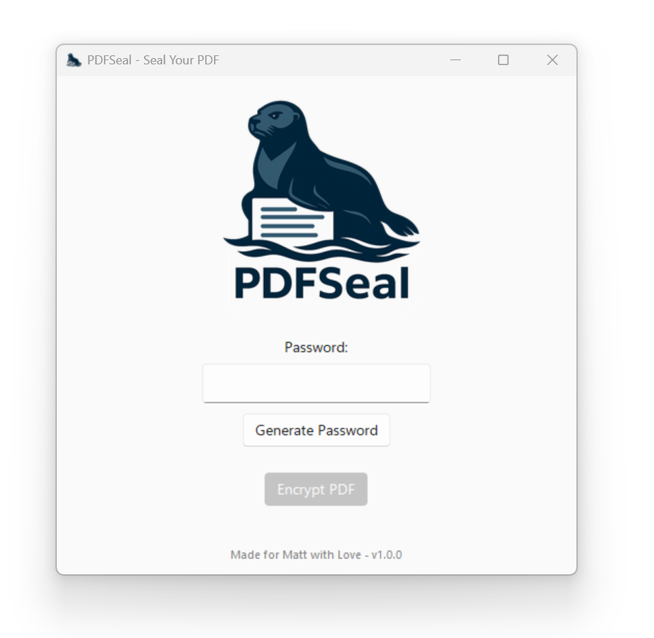

PDFSeal
PDFSeal is a lightweight, cross-platform PDF encryption tool that lets you securely password-protect your PDF files with ease. Built with Python and a sleek Tkinter GUI, it's simple, efficient, and visually delightful — complete with a lounging seal.

🔐 Features
AES-128 PDF encryption using PyPDF2

Auto-generate strong, random passwords

Clean, cross-platform interface using tkinter + sv_ttk

Follows system light/dark theme

Custom branding, icons, and installer (Inno Setup support)

🖥️ Screenshots

🚀 Installation
📦 Windows Installer
Coming soon — check Releases

🔧 From Source
Requirements
Python 3.10+

pip install -r requirements.txt

Run
bash
Copy
Edit
python main.py
📦 Build It Yourself
PyInstaller
bash
Copy
Edit
pyinstaller pdfseal.spec
Inno Setup Installer
Build with Inno Setup using installer.iss

🧪 Tech Stack
Python 3.12

Tkinter GUI

sv_ttk for theming

PyPDF2 for encryption

Pillow for image handling

🐾 About
Created by SkinnyLabs.
PDFSeal is open-source and free to use under the MIT License.

📜 License
MIT License

🤝 Contribute
PRs and suggestions welcome!
Got ideas or want to brand your own tool with a seal? Open an issue!