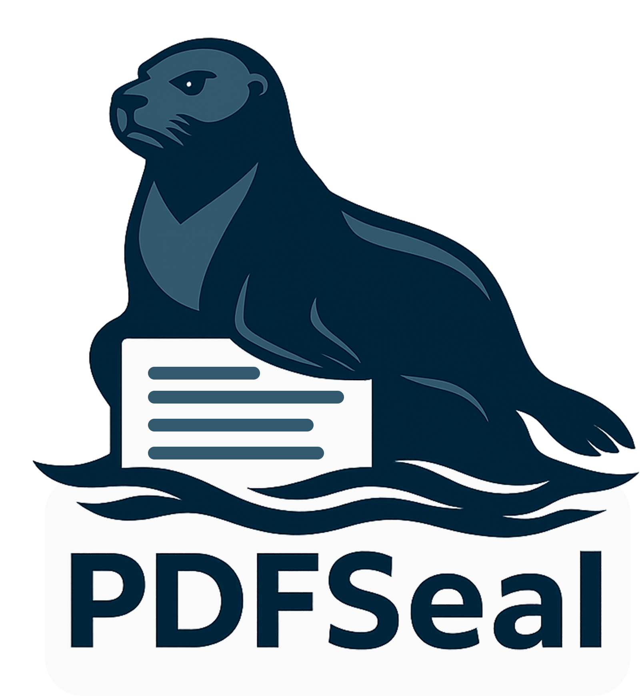

<p align="center">
  
</p>


PDFSeal is a lightweight, cross-platform PDF encryption tool that lets you securely password-protect your PDF files with ease. Built with Python and a sleek Tkinter GUI, it's simple, efficient, and visually delightful — complete with a lounging seal.  Just enter a password (or have the Seal generate one for you) and press encrypt, thats it. Now you don't have to pay for a certain overly-priced PDF viewer just to encrypt PDFs. 


🔧 From Source
Requirements
Python 3.10+

pip install -r requirements.txt

``` bash
python main.py
```

📦 Build It Yourself
``` bash
pyinstaller pdfseal.spec
```

🚀 Ship it... 
Build with Inno Setup using installer.iss

🧪 Components
Python 3.12
Tkinter GUI
sv_ttk for theming
PyPDF2 for encryption
Pillow for image handling

🐾 About
Created by SkinnyLabs.
PDFSeal is open-source and free to use under the MIT License.

📜 License
MIT License

🤝 Contribute
PRs and suggestions welcome!
Got ideas or want to brand your own tool with a seal? Open an issue!
